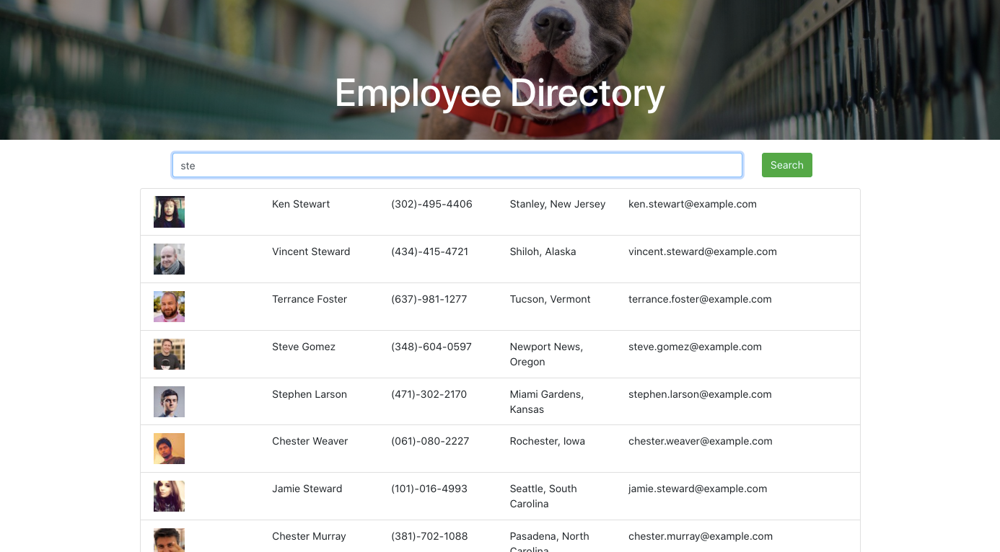

  # User Directory 
  
  ## Description
    User Directory is an applicaiton that allows you to keep track of employees and access non-sensitive data. The search box will yeild employees by their name or letter.

  

  ## Table of Contents
  - [Links](#links)
  - [Installation](#installation)
  - [Usage](#usage)
  - [License](#license)
  - [Tests](#tests)
  - [Contributors](#contributors)
  - [Details](#details)

  ## Links
  Application Link: https://johngarcia144.github.io/user-directory/ Github Link: https://github.com/johngarcia144/user-directory/
  
  ## Installation
  Packages required to run this program are: npm i, npm bootstrap
  
  ## Usage
  Examples of how to use this program: n/a

  ## License
  None

  ## Tests
  To test, run the following commands: npm start

  ## Contributors
  John Garcia

  ## Contact
  
 
  

  
https://github.com/johngarcia144
  
If you have any questions, contact the author directly at john.garcia144@gmail.com.
 